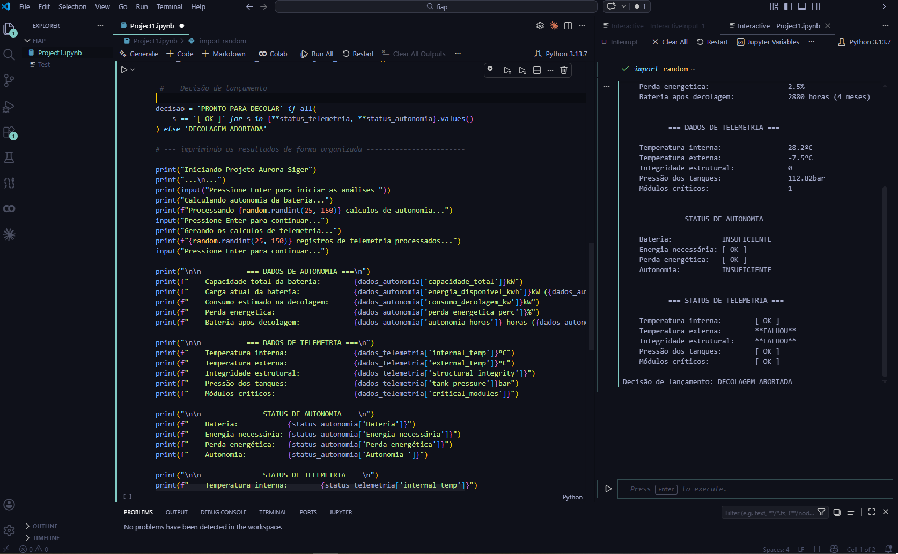

# Projeto Aurora-Siger

Sistema de simulação de verificação pré-lançamento que gera dados aleatórios de telemetria e autonomia energética, avalia cada parâmetro contra limiares operacionais e emite uma decisão de lançamento automatizada.

---

## Arquivos e descrição desse repositório

- prompt_relatorio_aurora_siger.txt - Prompt utilizado para criar o PDF de relatório e analise assistida por IA

- fluxograma.png - Imagem do fluxograma exigido pelo avaliador

- pseudocodigo.txt - Txt contendo o código em pseudocodigo exigido pelo avaliador

- Prints(1)(2).png - Prints da execução do código em python

- AuroraSiger-Analise-IA.pdf - Analise em PDF solicitada a IA contendo, classificação, identificação de dados e anomalias e riscos do projeto

- AuroraSiger-CodigoPython.pdf - PDF do codigo python completo do projeto

- Reflexaocritica.txt - Uma reflexao critica em TXT acerca dos benefícios e tecnologias geradas pelo projeto 


## Sumário do projeto

- [Visão Geral](#visão-geral)
- [Funcionalidades](#funcionalidades)
- [Estrutura do Código](#estrutura-do-código)
- [Parâmetros e Limiares](#parâmetros-e-limiares)
- [Lógica de Decisão](#lógica-de-decisão)
- [Como Executar](#como-executar)
- [Requisitos](#requisitos)

---

## Visão Geral

O Aurora-Siger simula o ciclo completo de verificação pré-lançamento de uma aeronave. A cada execução, valores aleatórios são gerados para variáveis de telemetria de bordo e autonomia energética. Cada variável é comparada com sua faixa operacional nominal e recebe um status individual. A decisão final de lançamento só é liberada se **todos** os parâmetros estiverem dentro dos limiares.

---

## Funcionalidades

- Geração aleatória de dados de telemetria (temperatura, pressão, integridade estrutural, módulos críticos)
- Cálculo de autonomia energética com base em capacidade, carga atual, consumo e perdas
- Avaliação individual de cada parâmetro com status `[ OK ]` ou falha
- Decisão automatizada de lançamento: `PRONTO PARA DECOLAR` ou `DECOLAGEM ABORTADA`
- Exibição interativa no terminal com pausas entre etapas

---

## Estrutura do Código

```
aurora_siger.py
├── gerar_telemetria() - Gera e avalia os parâmetros de telemetria
├── calcular_autonomia() - Gera e avalia os parâmetros energéticos
└── Programa principal  - Chama as funções, decide e exibe os resultados
```

### `gerar_telemetria()`

Gera aleatoriamente variáveis de bordo e avalia cada uma contra seus limiares operacionais.

Retorna dois dicionários: `dados_telemetria` e `status_telemetria`.

---

### `calcular_autonomia()`

Calcula a autonomia energética da aeronave com base em valores sorteados e derivados.

Retorna dois dicionários: `dados_autonomia` e `status_autonomia`.

---

## Parâmetros e Limiares

Resumo completo de todos os parâmetros monitorados e suas condições de aprovação:

| Parâmetro               | Condição de aprovação  |
|-------------------------|------------------------|
| Temperatura interna     | 21 °C <= valor <= 30 °C|
| Temperatura externa     | -5 °C <= valor <= 30 °C|
| Integridade estrutural  | valor == 1             |
| Pressão dos tanques     | 95 <= valor <= 145 bar |
| Módulos críticos        | valor == 1             |
| Carga da bateria        | >= 80%                 |
| Energia útil            | >= 10 kWh              |
| Perda energética        | <= 5%                  |
| Autonomia               | >= 10 meses            |

---

## Lógica de Decisão

Após a avaliação de todos os parâmetros, os dicionários `status_telemetria` e `status_autonomia` são combinados. Se **todos** os valores forem `[ OK ]`, o lançamento é liberado. Qualquer falha resulta em no cancelamento da decolagem.

```python
decisao = 'PRONTO PARA DECOLAR' if all(
    s == '[ OK ]' for s in {**status_telemetria, **status_autonomia}.values()
) else 'DECOLAGEM ABORTADA'
```

---

## Como Executar

Nenhuma dependência externa é necessária. Apenas Python 3.6 ou superior.

```bash
python aurora_siger.py
```

O programa solicita confirmações do usuário via `Enter` entre cada etapa, simulando um fluxo de verificação interativo.

---


## Requisitos

- Python 3.6+
- Módulo `random` (biblioteca padrão — nenhuma instalação necessária)

## Prints da execução

